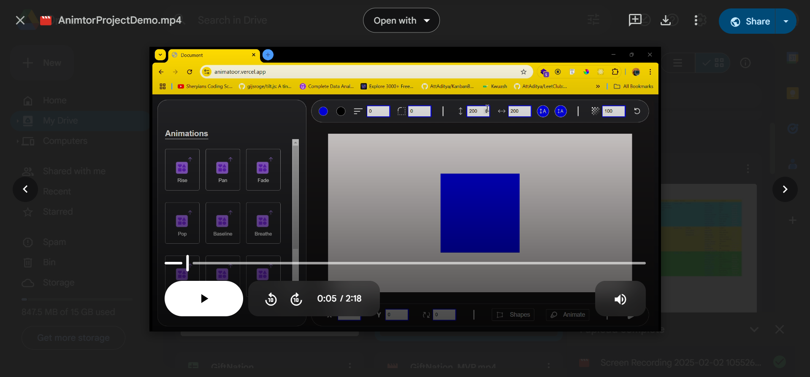
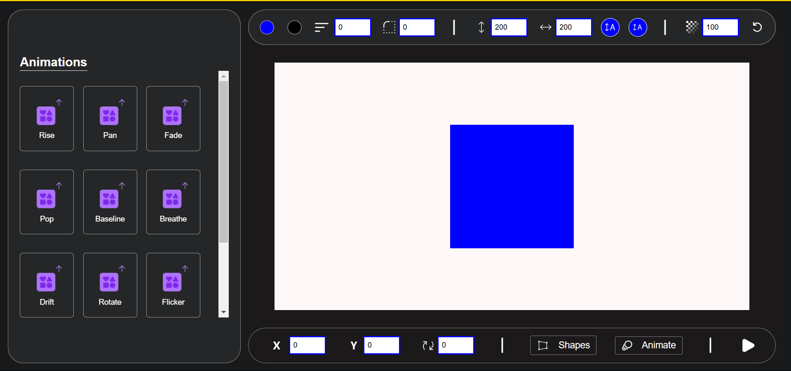
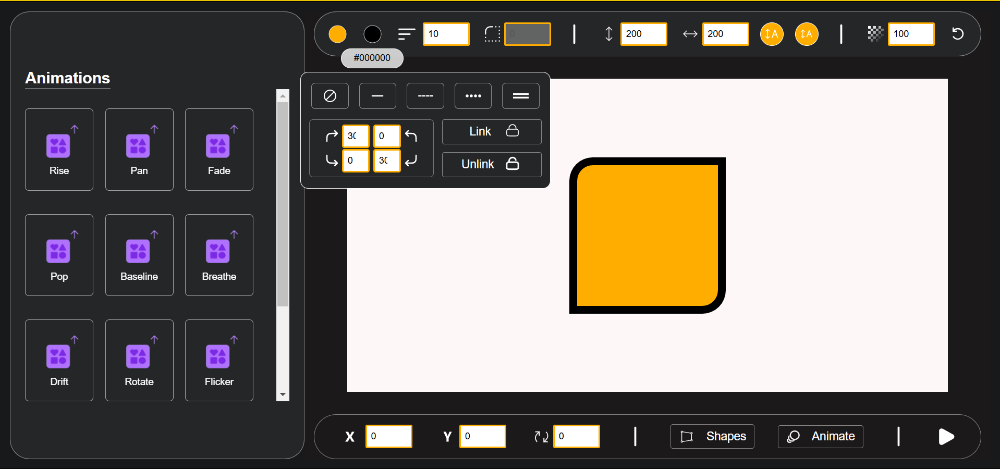
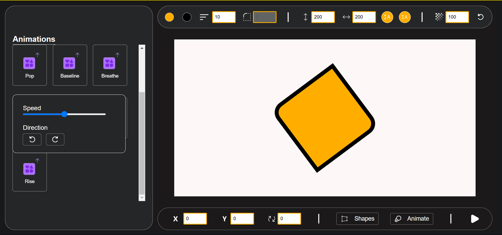
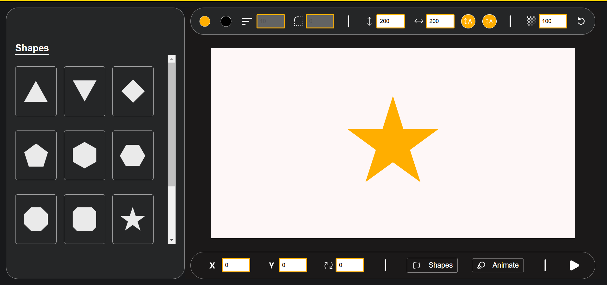

# [Animator - Version 1.0](https://animatoor.vercel.app/)

## Table of Contents
- [Introduction](#introduction)
- [Technologies Used](#technologies-used)
- [Features](#features)
- [Installation](#installation)
- [Usage](#usage)
- [Project Demo](#demo)
- [Contact](#contact)

## Introduction
This is a project built using HTML, CSS, JS and GSA. The focus while building this project was to understand how animations can be implemented in real world use cases and how something like Canva functions.

## Technologies Used
- HTML5
- CSS3
- Javascript
- GSAP

## Features
- **Custom Shapes**: This feature enables users to select shapes from a collection including sqaure, rectangle, circle, start, pentagon etc which was made possible using clip paths in ```CSS```.

- **Custom Animation**: This features enables users to set animations to their shape from a collection of Rise, Pop, Breathe, Rotate etc. which was exectued using a JS library named ```GSAP```.

- **Shape Properties**: This includes multiple basic features like color, border, border-radius, opacity, height, width, position, etc.

## Installation
To view this project locally, follow these steps:

1. Clone the repository:
   ```bash
   git clone https://github.com/NishB369/Animator
   ```
2. Navigate to the project directory:
    ```bash
    cd Animator
    ```
3. Open the ```index.html``` file in your web browser.

## Usage
* Open the project in your browser to view the application.
* Explore the features and functionalities implemented using HTML, CSS, JS and GSAP.
* Or you can directly have a look at [link](https://animatoor.vercel.app/).

## Demo
[Project Demo Video](https://drive.google.com/file/d/1jrKF_ulj3b3TJJ4a0ssVsGg24iYXDO-j/view?usp=sharing)







## Contact
* For any inquiries or feedback, feel free to reach out:
    * [LinkedIn](https://www.linkedin.com/in/nishchay-bhatia/)
    * nishbcodes@gmail.com 
